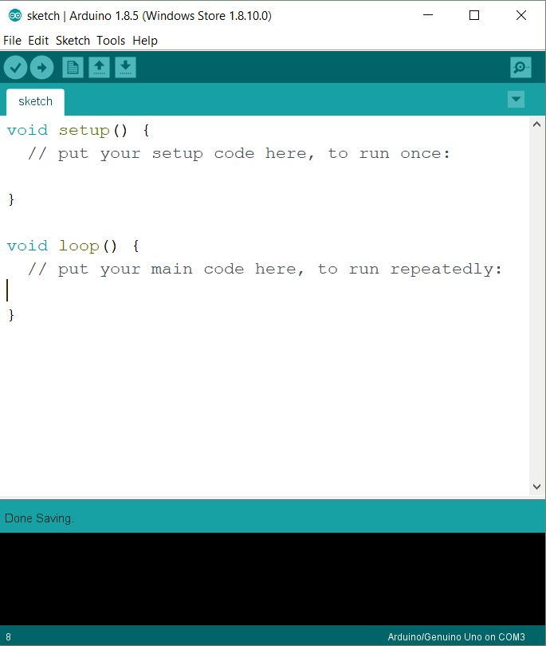

# BMES Basic Arduino Workshop

*by Anson Fu for NTU Biomedical Engineering Society*

This workshop is based on ARDUINO IDE 1.8.5, ARDUINO UNO R3 Board and assumes zero knowledge of C Language.

***Disclaimer*** *-* *This document is only meant to serve as a reference for the attendees of the workshop. It does not cover all the concepts or implementation details discussed during the actual workshop.*

### Workshop Details:

**When?**: Satauday, 12 May 2018. 9:00 AM - 1:00 PM. 
**Where?**: TR +27, The Hive, Nanyang Technological University 
**Who?**: NTU Biomedical Engineering Society

### Questions?

Raise your hand at any time during the workshop or shoot me an [e-mail](mailto:askbmes@gmail.com) later.

### Errors?

If you find any mistake (typo or anything else), please make a pull request or [post an issue](https://github.com/ansonfu886/BMES-BasicArduinoWorkshop/issues/new)! Thanks!

## Step 0 - Initial Setup

1. Download [ARDUINO IDE](https://www.arduino.cc/en/Main/Software).
2. Pair up as a team.
3. Make sure your team has one Arduino UNO board with USB cable and solderless breadboard.
4. Turn on Arduino IDE and move on to Step 1 !

## Step 1 - Introduction of Arduino

### 1.1 What is Arduino? Why Arduino?
Arduino is an open-source electronics platform based on easy-to-use hardware and software. Arduino boards are able to read inputs and turn it into an output.  
Arduino boards are relatively inexpensive compared to other microcontroller platforms. The Arduino Software (IDE) is easy-to-use for beginners, yet flexible enough for advanced users to take advantage of as well.

### 1.2 Arduino integrated development environment (IDE)
In this workshop, we will be using the Arduino IDE to write code to program the Arduino board.
The Arduino IDE is a cross-platform application provides a text editor with the typical IDE
features like syntax highlighting, a compiler to compile and upload code to the board.  
A program written with the Arduino IDE is called a sketch. Sketches are saved on the
development computer as text files with the file extension ".ino". The Arduino IDE utilises C++
as its programming language and contains various libraries catered to the Arduino.

